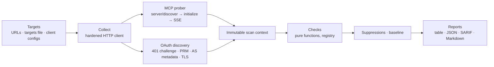

# mcp-posture

[](https://github.com/batou9150/mcp-posture/actions/workflows/ci.yml)
[](https://github.com/batou9150/mcp-posture/actions/workflows/action-selftest.yml)
[](LICENSE)

**Security posture scanner for remote MCP servers.** Point it at a Streamable HTTP endpoint and
it audits the OAuth setup (MCP Authorization spec, RFC 9728, RFC 8414, PKCE, RFC 8707, Client ID
Metadata Documents), transport hardening and the tool surface (poisoning, shadowing, rug pulls),
with spec-cited findings and CI-native output (SARIF, JSON, Markdown).

> Status: release candidate (`1.0.0-rc1`), not yet on PyPI. Only scan servers you own or are authorized to test.

## Why

Most MCP scanners inspect local client configs and stdio servers. `mcp-posture` focuses on
**remote** servers and what an attacker sees from the outside before logging in: how the server
challenges, which authorization server it trusts, whether that server enforces PKCE S256, whether
tokens are audience-bound, whether the tool descriptions hide instructions. Every finding cites the
spec section and the MCP revision it applies to (`2025-03-26` through `2026-07-28`).

## Quickstart

```bash
# from source until the first PyPI release
uvx --from git+https://github.com/batou9150/mcp-posture mcp-posture scan https://mcp.example.com/mcp

# machine-readable outputs, fail the build on high or worse
mcp-posture scan https://mcp.example.com/mcp --sarif results.sarif --markdown summary.md --fail-on high

# lint your own client's Client ID Metadata Document
mcp-posture cimd lint https://app.example.com/oauth/client.json

# scan every remote server declared in your MCP clients (.mcp.json, Claude, VS Code, Cursor, Windsurf)
mcp-posture discover
mcp-posture scan --from-client-config auto

# list tools behind authentication: pass a token through the environment, never on the command line
MCP_TOKEN=... mcp-posture scan https://mcp.example.com/mcp --token-env MCP_TOKEN
```

**Docker** (distroless, nonroot):

```bash
docker build -t mcp-posture https://github.com/batou9150/mcp-posture.git
docker run --rm mcp-posture scan https://mcp.example.com/mcp
```

**GitHub Action** (SARIF to code scanning, Markdown to the job summary):

```yaml
- uses: batou9150/mcp-posture@main   # pin a tag or SHA
  with:
    targets-file: mcp-servers.txt
    fail-on: high
```

**Claude Code skill**: the scanner plus a semantic review of tool descriptions, prioritization and
remediation snippets for common authorization servers and gateways.

```text
/plugin marketplace add batou9150/nanobanana-skill
/plugin install mcp-posture@batou9150-skills
```

Then ask *"audit the security of https://mcp.example.com/mcp"*.


Sample output (local misconfigured fixture, `scripts/demo_servers.py`):

```
http://127.0.0.1:8402/mcp
  spec 2025-06-18 (negotiated) · transport streamable-http · auth not required
critical MCPP-ASM04   code_challenge_methods_supported ['plain'] does not include S256.
high     MCPP-ASM02   Metadata declares issuer 'http://127.0.0.1:8402/', expected 'http://127.0.0.1:8402'.
high     MCPP-AUTHN01 tools/list answered without credentials (2 tool(s) including delete_note).
high     MCPP-PRM06   bearer_methods_supported includes `query`.
high     MCPP-TRN08   Session IDs look sequential (numerically close across two sessions).
medium   MCPP-PRM03   resource '.../mcp/' does not match '.../mcp' (trailing slash only).
...
```

## What it checks

| Family | Checks | Covers |
|---|---|---|
| `TRN` | 10 | HTTPS, TLS version and certificate, HTTP→HTTPS, HSTS, legacy SSE, session IDs in URLs, `Mcp-Session-Id` entropy, metadata headers |
| `AUTHN` | 6 | Anonymous `tools/list`, Bearer challenge, `resource_metadata` discovery, error leakage |
| `PRM` | 11 | RFC 9728 Protected Resource Metadata: presence, `resource` exact match, authorization servers, query tokens, scopes, signed metadata |
| `ASM` | 13 | RFC 8414 / OIDC metadata: issuer match, HTTPS endpoints, PKCE S256 / `plain`, implicit and password grants, DCR, `iss` (RFC 9207) |
| `CIMD` | 10 | Client ID Metadata Document support and registration strategy; `cimd lint` rules for your own client's document |
| `SCP` | 3 | Over-broad scopes, missing `scope` in challenges, PRM/AS scope consistency |
| `TOOL` | 10 | Instruction-like text, invisible/bidi/tag Unicode, encoded blobs, shadowing, secret paths and exfil URLs, annotations, unconstrained URL/path/code inputs, confusable names, nesting too deep to inspect |
| `PIN` | 4 | Rug pulls: tools/prompts/resources added, removed or changed since `mcp-posture pin` |

`mcp-posture checks list` prints the catalogue; `mcp-posture checks show MCPP-ASM04` explains one
check (rationale, remediation, references). Check IDs are stable and never reused.
The research behind the catalogue, with every MUST/SHOULD mapped to a check, is in
[`docs/spec-notes.md`](docs/spec-notes.md).

The default mode is **passive**: metadata `GET`s plus the standard MCP handshake and list calls.
No tool is ever called. Behaviours that only an active probe could confirm (Origin validation,
token audience enforcement, PKCE enforcement) are listed as not verified in
[`docs/spec-notes.md`](docs/spec-notes.md).

## How it works



Each target is collected once (all network I/O, through a client that refuses private addresses
at connect time), frozen into a context, then every check runs as a pure function over it. A
failing check becomes an `MCPP-ERR00` finding instead of aborting the scan.

## CI usage

```toml
# mcp-posture.toml (CLI flags override it)
[scan]
targets_file = "mcp-servers.txt"
fail_on = "high"
baseline = "mcp-posture.lock.json"   # rug-pull detection, created with `mcp-posture pin`
disable = ["ASM08"]
```

```toml
# .mcp-posture-ignore: every suppression needs a justification; expired ones resurface
[[ignore]]
check = "MCPP-ASM09"
target = "https://mcp.example.com/*"
justification = "Open DCR is intended: public client registry"
expires = 2026-12-31
```

SARIF results are anchored to the line of the file that declares each target (targets file,
`mcp-posture.toml`, `.mcp.json`), so GitHub code scanning can display them.

| Exit code | Meaning |
|---|---|
| `0` | No finding at or above `--fail-on`, every target reachable |
| `1` | At least one unsuppressed finding at or above `--fail-on` |
| `2` | Usage or configuration error |
| `3` | A target was unreachable (and no blocking finding) |

## Safety of the scanner

- Tokens are read only from an env var, a file or stdin, and are redacted from every output and log.
- Private, loopback, link-local and cloud-metadata addresses are refused at connect time (after DNS
  resolution, every redirect hop included) unless `--allow-private` is passed.
- Credentials are never forwarded across origins; response size and time are capped.
- Server-controlled text is neutralized in reports: no raw control, bidi or invisible characters
  reach your terminal or PR comments.
- No telemetry.

## Compared with other MCP scanners

Several good tools exist; they solve different problems. Facts as of 2026-10 (see
[`docs/spec-notes.md`](docs/spec-notes.md) for the survey):

| | mcp-posture | [Snyk agent-scan](https://github.com/snyk/agent-scan) | [Cisco mcp-scanner](https://github.com/cisco-ai-defense/mcp-scanner) | [Ramparts](https://github.com/highflame-ai/ramparts) | [MCPJam OAuth conformance](https://docs.mcpjam.com/cli/oauth-conformance) |
|---|---|---|---|---|---|
| Focus | remote server posture | local agent configs and tools | configs, stdio and remote servers | servers, configs, skills | live OAuth flow conformance |
| OAuth / PRM / AS metadata audit (pre-login) | yes, per RFC, per MCP revision | no | no | no | yes (needs a login) |
| Tool poisoning analysis | regex heuristics (+ semantic review via the skill) | remote API analysis | YARA + LLM | YARA + LLM | no |
| Rug-pull pinning | yes | signatures | no | yes | no |
| SARIF | yes | no | no | yes | no (JUnit) |

Pair `mcp-posture` with a runtime proxy (e.g. [mcp-context-protector](https://github.com/trailofbits/mcp-context-protector))
for enforcement; it reports, it does not block.

## Responsible use

Scan only servers you own or have written permission to test. Passive mode sends a handful of
standard requests; even so, unsolicited scanning of third-party infrastructure may violate their
terms or the law.

## Contributing and security

See [CONTRIBUTING.md](CONTRIBUTING.md) (how to add a check) and [SECURITY.md](SECURITY.md)
(reporting vulnerabilities, verifying release signatures and attestations).

## Development

```bash
uv sync
uv run ruff check && uv run ruff format --check && uv run mypy && uv run pytest
uv run python scripts/demo_servers.py   # local fixtures to scan with --allow-private
uv run --group docs mkdocs serve         # docs site
```

## License

[MIT](LICENSE) © Baptiste PIRAULT
