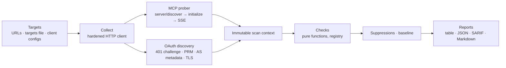

# mcp-posture

**Security posture scanner for remote MCP servers.** It audits what an attacker sees from the
outside, before logging in: the OAuth setup (MCP Authorization spec, RFC 9728, RFC 8414, PKCE,
RFC 8707, Client ID Metadata Documents), transport hardening, and the tool surface (poisoning,
shadowing, rug pulls). Every finding cites the spec section and the MCP revision it applies to.

!!! warning "Responsible use"
    Only scan servers you own or are authorized to test. The default passive mode sends a handful
    of standard requests, but unsolicited scanning of third-party infrastructure may still breach
    their terms of service or the law.

- [Quickstart](quickstart.md): install and run your first scan.
- [Checks](checks/index.md): the full catalogue, generated from the code.
- [CI integration](ci.md): GitHub Action, SARIF upload, exit codes.
- [Threat model](threat-model.md): how the scanner protects itself and you.
